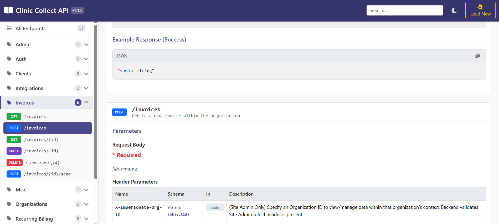

# Interactive OpenAPI Viewer with AI Assistant

[](https://opensource.org/licenses/MIT)

A web-based tool to load, view, and interact with OpenAPI (v3) specifications. Browse endpoints categorized by tags, view details including parameters and schemas, see code examples, and utilize an optional AI assistant (powered by Anthropic Claude 3.5 Sonnet) to answer questions about the API.



## Key Features

**Frontend OpenAPI Viewer (`src/`)**

*   **Load Specs:** Upload OpenAPI v3 spec files (`.json` or `.yaml`) or paste raw content.
*   **Parsing & Validation:** Uses `js-yaml` and provides basic validation feedback.
*   **Interactive UI:** Built with React, Vite, and Bootstrap 5.
*   **Sidebar Navigation:** Browse endpoints grouped by tags (categories). Shows endpoint counts.
*   **Detailed Endpoint View:** Displays path, method, summary, description, parameters, request bodies, and responses.
*   **Schema Viewer:** Renders nested schemas for parameters, request bodies, and responses. Handles basic `$ref` resolution within the spec.
*   **Code Examples:** Generates request examples for cURL, JavaScript (Fetch), TypeScript (Fetch), and Python (requests).
*   **Syntax Highlighting:** Uses `react-syntax-highlighter` with language auto-detection and theme support.
*   **Copy-to-Clipboard:** Easily copy code examples.
*   **Search:** Filter endpoints by path, summary, description, or tags (debounced).
*   **Dark Mode:** Toggle between light and dark themes (persisted in localStorage).
*   **Responsive:** Adapts to different screen sizes.
*   **Deep Linking:** Supports linking directly to categories or specific endpoints via URL hash (`#`).

**Backend AI Assistant (`service/`) - In Progress**

*   **Claude Integration:** Uses the Anthropic API (Claude 3.5 Sonnet) via `@anthropic-ai/sdk`.
*   **API Context:** Provided with a system prompt tailored for understanding and explaining APIs based on the *pre-loaded* documentation (`service/data/apiData.json`).
*   **Tool Use:** Equipped with a `search_documentation` tool to find relevant endpoint details within the *pre-loaded* data.
*   **Multi-Turn Interaction:** Can use the search tool multiple times within a single query for better results.
*   **Streaming Responses:** Uses Server-Sent Events (SSE) via a `GET /api/chat` endpoint for real-time updates (Thinking -> Searching -> Final Answer).
*   **Standard Request/Response:** Also supports `POST /api/chat` for non-streaming interactions.
*   **Conversation Management:** Basic in-memory tracking of conversation history per `conversationId`.

**Important Note:** The current AI Assistant backend (`service/`) operates on a **static JSON file** (`service/data/apiData.json`) derived from *one specific* API specification. It **does not dynamically use the OpenAPI spec loaded in the frontend viewer**. To make the AI Assistant query the *currently loaded* spec, the `service` would need significant modification to receive and parse the spec data from the frontend or access it directly. I'm working on making this automatic.

## Tech Stack

*   **Frontend:**
    *   React 18+ (with Hooks)
    *   Vite
    *   JavaScript / TypeScript (Examples generated)
    *   Bootstrap 5
    *   `react-syntax-highlighter` / `highlight.js`
    *   `clipboard.js`
    *   `js-yaml`
*   **Backend (Optional AI Assistant):**
    *   Node.js
    *   Express.js
    *   Anthropic SDK (`@anthropic-ai/sdk`)
    *   `dotenv`
    *   `cors`
*   **Linting:** ESLint

## Getting Started

### Prerequisites

*   Node.js (v18 or later recommended)
*   npm or yarn

### Installation & Setup

1.  **Clone the repository:**
    ```bash
    git clone https://github.com/ammonwk/automatic-api-docs.git
    cd your-repo-name
    ```

2.  **Install Root Dependencies (Frontend):**
    ```bash
    npm install
    # or
    yarn install
    ```

3.  **Install Backend Dependencies:**
    ```bash
    cd service
    npm install
    # or
    yarn install
    cd ..
    ```

4.  **Configure Environment Variables (for AI Assistant):**
    *   Navigate to the `service` directory.
    *   Create a file named `.env`.
    *   Add your Anthropic API key:
        ```dotenv
        # service/.env
        ANTHROPIC_API_KEY=your_anthropic_api_key_here
        PORT=8002 # Optional: Specify the port for the backend service
        ```
    *   **(Important Data File):** Ensure you have the relevant API data in `service/data/apiData.json`. The current AI assistant relies entirely on this file.

### Running the Application

You need to run both the frontend development server and the backend service (if using the AI Assistant).

1.  **Run the Frontend (Vite Dev Server):**
    From the project root directory:
    ```bash
    npm run dev
    # or
    yarn dev
    ```
    This will typically start the frontend on `http://localhost:5173`.

2.  **Run the Backend Service (Node/Express):**
    From the project root directory:
    ```bash
    node service/index.js
    ```
    Or, add a script to your root `package.json`:
    ```json
    // package.json
    "scripts": {
      "dev": "vite",
      "build": "vite build",
      "lint": "eslint . --ext js,jsx --report-unused-disable-directives --max-warnings 0",
      "preview": "vite preview",
      "start:service": "node service/index.js" // Add this line
    },
    ```
    And run:
    ```bash
    npm run start:service
    # or
    yarn start:service
    ```
    The backend service will run on the port specified in `service/.env` or default to `8002`.

Now you can open the frontend URL (`http://localhost:5173` by default) in your browser.

## Usage

1.  **Load Specification:**
    *   Click "Upload File" to select a `.json` or `.yaml` OpenAPI spec file.
    *   Alternatively, paste the raw JSON or YAML content into the text area and click "Load from Paste".
2.  **Browse:**
    *   Use the left sidebar to navigate between different tag groups (categories).
    *   Click a category header to expand/collapse its endpoints.
    *   Click "All Endpoints" to view all endpoints regardless of category.
    *   Clicking a category header or an endpoint link in the sidebar scrolls the corresponding section/card into view in the main panel.
3.  **Search:**
    *   Use the search bar in the navbar to filter endpoints. Results update automatically as you type.
4.  **View Details:**
    *   Scroll through the main panel to see endpoint cards.
    *   Each card shows the method, path, summary, description, parameters, request body, responses, and code examples.
    *   Expand complex schemas in the parameters or response sections.
5.  **Code Examples:**
    *   Switch between cURL, JavaScript, TypeScript, and Python examples using the tabs.
    *   Click the copy icon to copy the code snippet.
6.  **AI Assistant (If Backend is Running):**
    *   *(Requires backend setup and running)* An interface element (currently not shown in the provided frontend code) would be needed to interact with the `POST /api/chat` or `GET /api/chat` endpoints.
    *   Send questions about the API documented in `service/data/apiData.json`.
    *   The assistant uses the `search_documentation` tool to find relevant info and synthesizes an answer.

## Project Structure

```
├── eslint.config.js        # ESLint configuration
├── service/                # Node.js backend (AI Assistant)
│   ├── controllers/        # Request handlers (chatController.js)
│   ├── data/               # Static data used by the AI (apiData.json) <-- IMPORTANT
│   ├── index.js            # Express server entry point
│   ├── routes/             # API route definitions (api.js)
│   └── utils/              # Backend helpers (prompts, tools, execution)
├── src/                    # React frontend source
│   ├── App.css             # Main App component styles
│   ├── App.jsx             # Root React component
│   ├── components/         # Reusable UI components
│   ├── contexts/           # React Context for global state (OpenApiContext)
│   ├── hooks/              # Custom React hooks (debounce, localStorage, parser)
│   ├── index.css           # Root CSS resets/globals
│   ├── main.jsx            # React application entry point
│   ├── styles/             # Global styles, themes, variables (index.css)
│   └── utils/              # Frontend helper functions (code gen, parsing utils)
├── vite.config.js          # Vite configuration
├── .env                    # (Gitignored) - Example for service/.env
├── package.json            # Project dependencies and scripts (Root for frontend)
└── README.md               # This file
```

## Contributing

Contributions are welcome! Please feel free to submit issues and pull requests.

1.  Fork the repository.
2.  Create a new branch (`git checkout -b feature/your-feature`).
3.  Make your changes.
4.  Commit your changes (`git commit -m 'Add some feature'`).
5.  Push to the branch (`git push origin feature/your-feature`).
6.  Open a pull request.

## License

This project is licensed under the MIT License.

---

```
MIT License

Copyright (c) 2025 Ammon Kunzler

Permission is hereby granted, free of charge, to any person obtaining a copy
of this software and associated documentation files (the "Software"), to deal
in the Software without restriction, including without limitation the rights
to use, copy, modify, merge, publish, distribute, sublicense, and/or sell
copies of the Software, and to permit persons to whom the Software is
furnished to do so, subject to the following conditions:

The above copyright notice and this permission notice shall be included in all
copies or substantial portions of the Software.

THE SOFTWARE IS PROVIDED "AS IS", WITHOUT WARRANTY OF ANY KIND, EXPRESS OR
IMPLIED, INCLUDING BUT NOT LIMITED TO THE WARRANTIES OF MERCHANTABILITY,
FITNESS FOR A PARTICULAR PURPOSE AND NONINFRINGEMENT. IN NO EVENT SHALL THE
AUTHORS OR COPYRIGHT HOLDERS BE LIABLE FOR ANY CLAIM, DAMAGES OR OTHER
LIABILITY, WHETHER IN AN ACTION OF CONTRACT, TORT OR OTHERWISE, ARISING FROM,
OUT OF OR IN CONNECTION WITH THE SOFTWARE OR THE USE OR OTHER DEALINGS IN THE
SOFTWARE.
```